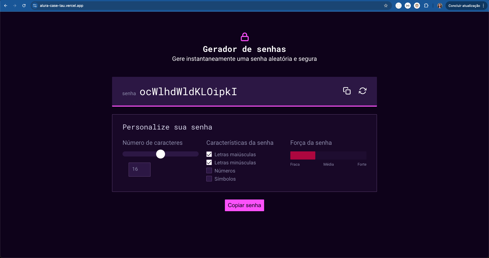
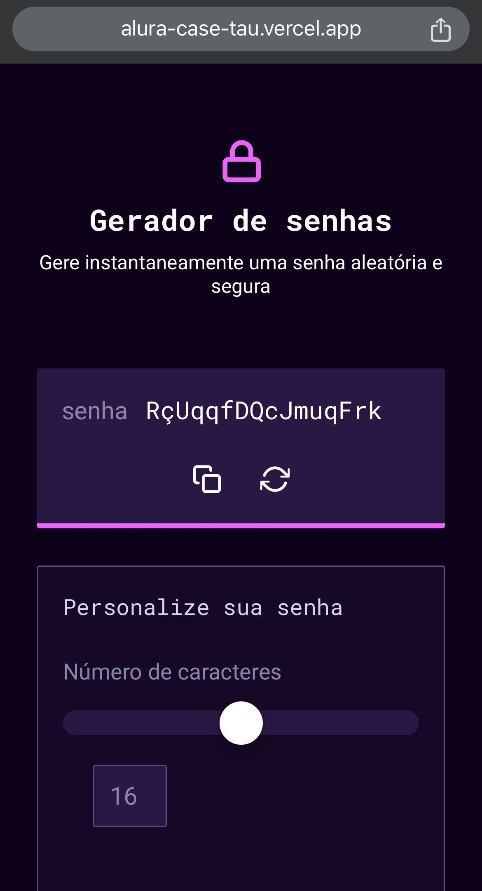
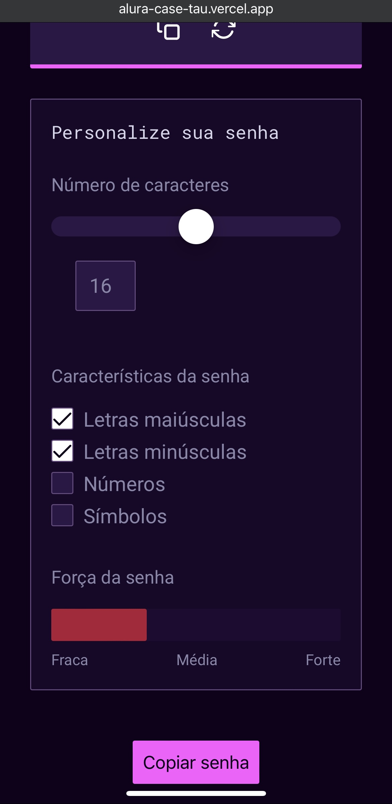
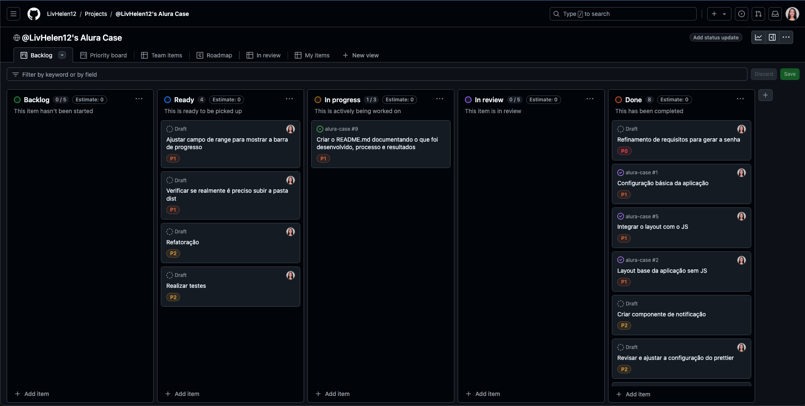

# Gerador de Senha

## Conteúdo
1. [Descrição do projeto](#descrição-do-projeto)
2. [Pré-requisitos](#pré-requisitos)
    1. [Instalação do projeto](#instalação-do-projeto)
    2. [Instruções de uso](#instruções-de-uso)
    3. [Tecnologias adicionais](#tecnologias-adicionais)
3. [Visualização do projeto](#visualização-do-projeto)
4. [Backlog](#backlog)
5. [Aprendizados](#aprendizados)


## Descrição do projeto
O [gerador de senhas](https://alura-case-tau.vercel.app/) permite o usuário gerar senhas de acordo com a personalização que ele desejar. 

É possível acrescentar letras maiúsculas, minúsculas, símbolos, números, além de poder escolher o tamanho da senha. [O projeto pode ser visualizado clicando aqui](https://alura-case-tau.vercel.app/).

Esse projeto foi construído utilizando `HTML`, `SASS` e `JavaScript` como parte do caso de teste da Alura.

<div style="display: flex; gap: 16px">


</div>

## Pré-requisitos
Tecnologia     | Versão que estou utilizando
--------       | -----------------------
Node.js        | [v.18.20.2](https://nodejs.org/en/download/package-manager)
Live Server    | [Live Server Download](https://marketplace.visualstudio.com/items?itemName=ritwickdey.LiveServer)

### Observação
> O Live Server é uma extensão que pode ser encontrado dentro do [Visual Studio Code (VSCode)](https://code.visualstudio.com/). 

>Caso você utilize outra IDE que não tenha uma extensão similar, você pode encontrar o arquivo `HTML` na pasta onde você salvou o projeto, copiar o caminho e colar no navegador que funcionará igualmente.


## Instalação do projeto
Para conseguir rodar o projeto localmente na sua máquina, é necessário seguir os seguintes passos:

1. É preciso clonar o repositório do projeto

```git
git clone https://github.com/LivHelen12/alura-case.git
```

2. Após abrir o projeto em sua IDE de preferência, precisamos instalar as dependências do projeto

```bash
npm install
```

3. Antes de fazer alterações nos estilos da aplicação, precisa rodar: 

```bash
npm watch:css
```
> Como o `SASS` é um pré-processador `CSS`, ele precisa ser convertido para `CSS` para os navegadores conseguirem interpretar. Esse comando permite que você visualize as atualizações de estilo em tempo real.

## Instruções de uso
Após seguir o passo a passo acima, se você estiver utilizando o `Live Server`, basta subir um novo servidor. 

Caso você não utilize nenhuma extensão, basta você procurar onde salvou o projeto, copiar o caminho de onde o `index.html` está e colar no navegador.

## Tecnologias adicionais
Para manter a padronização do código, estou utilizando o [`prettier`](https://marketplace.visualstudio.com/items?itemName=esbenp.prettier-vscode) e o [`eslint`](https://marketplace.visualstudio.com/items?itemName=dbaeumer.vscode-eslint).
Se você estiver utilizando o `VSCode` é recomendado instalar as extensões dessas duas ferramentas.

## Visualização do projeto







## Backlog
Para a organização do projeto, eu optei por criar um backlog com as tarefas que precisavam ser feitas. Utilizei o Github Projetos, [você pode visualizar meu backlog clicando aqui](https://github.com/users/LivHelen12/projects/1/views/1).

Cada tarefa que eu precisava realizar eu criava um novo card, onde cada card, quando iniciado, virava uma issue para ser resolvida. 

De modo geral, cada tarefa tinha uma prioridade de acordo com a nível de relevância do que estava sendo entregue ou o quão bloqueante para o andamento do projeto a tarefa era. 

Por exemplo, iniciei pelas tarefas de refinamento dos requisitos e criação da estrutura básica do projeto porque sem elas não tem como desenvolver as outras tarefas.




## Aprendizados
Como todos os projetos desenvolvidos sempre aprendemos alguma coisa, seja positivo ou pontos de melhoria. Vou listar algumas observações que eu tive ao longo do desenvolvimento.

### Pontos positivos
1. Configuração do `prettier` e o `eslint` para padronizar o código.
2. Utilizar o `SASS`, porque estava há um bom tempo sem utilizar.
3. Ler a documentação do `SASS` para auxiliar na definição de pastas do projeto.
4. Utilizar um backlog para gerenciar minhas tarefas.

### Postos de melhoria
1. Não comecei o projeto com a técnica de Mobile First e precisei refatorar iniciando o layout com o mobile posteriormente.
2. Estudar mais sobre estilização do `input range` porque eu tive empecilhos na estilização dele.
3. Poderia ter melhorado o modo de utilizar as classes com o `SASS`, essa tecnologia me oferece muitas coisas e poderia ter explorado mais e organizado melhor.
4. Melhorado a implementação dos breakpoints.
5. Deixar o projeto mais interativo e com mais animações.
